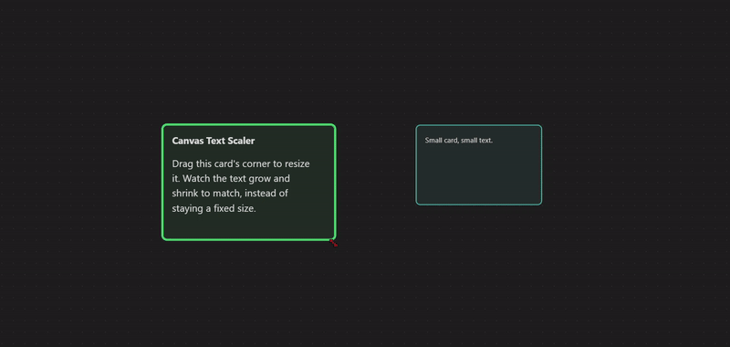

# Canvas Text Scaler

Scales the text inside an Obsidian Canvas card to the card's own size as you
resize it, instead of only scaling with canvas zoom.



*(GIF goes here once recorded, see the "Demo GIF" note below.)*

## Why this is a plugin and not a CSS snippet

Canvas card text scaling was tried in CSS first, twice, in the Rathgar Gold
theme's own `theme.css`. Both attempts failed, for reasons specific to how
Obsidian's Canvas renders and virtualizes nodes, and both are documented here
so nobody re-walks the same dead ends.

### Attempt 1: `container-type: size`

Reconstructed from the project's own retrofit log (the literal rule wasn't
kept, it was reverted immediately once confirmed broken):

```css
.canvas-node,
.canvas-node-container {
  container-type: size;
}
```

**Result: broke Canvas virtualization outright.** Cards fell back to their
raw placeholder text (the block-reference label, e.g. `Dashboard Session
Running > ^tonightsnpcs`) instead of rendering their embedded content.
`container-type: size` implies `contain: size layout style`, which
interferes with whatever internal mechanism (likely a `ResizeObserver`/
`IntersectionObserver` pair against the real node) Obsidian's Canvas uses to
decide when to swap a node from placeholder to fully-rendered embed.

### Attempt 2: `container-type: inline-size`

Same situation, reconstructed from the log, not the literal surviving rule:

```css
.canvas-node-container {
  container-type: inline-size;
}
```

**Result: did not break rendering, but text still didn't scale.** DevTools
showed font-size stuck at a flat 16px regardless of node size. The real
comment that survived in `theme.css` explaining why:

```css
/* Avoid container-type:size on .canvas-node or .canvas-node-container:
   it breaks Obsidian's own Canvas virtualization, so cards fall back to
   their raw placeholder text (the block reference label, e.g. "Dashboard
   Session Running > ^tonightsnpcs") instead of rendering the actual
   embedded content. container-type:size implies contain:size/layout/
   style, which interferes with whatever Obsidian's Canvas uses
   internally (ResizeObserver/IntersectionObserver against the real
   node) to decide when to swap a node from placeholder to fully-
   rendered embed. container-type:inline-size (width axis only) is
   safe, since it leaves height/block-size in normal flow. */
```

Root cause: Obsidian's **core** Canvas (not a plugin, confirmed by grepping
Advanced Canvas's own `main.js`, the string isn't there) already has a
built-in "font size relative to zoom" mechanism, a `--zoom-multiplier`
custom property plus a `data-disable-font-size-relative-to-zoom` attribute
on `.canvas-wrapper`. It compensates text size against *canvas zoom level*,
not *node size*, a different axis than what this plugin wants, and it wins
over a plain CSS font-size rule regardless of selector specificity.

### The risk test that unblocked the plugin

Before writing any lifecycle or observer code, one question had to be
answered: could a JS-set font-size survive that same zoom-compensation
mechanism? If not, this plugin would need to fight Canvas's internals
directly instead of just observing size and setting a style. Tested live in
a disposable canvas file:

```js
const wrapper = document.querySelector('.canvas-node .markdown-preview-view, .canvas-node .markdown-embed-content');
const targets = wrapper.querySelectorAll('*');
wrapper.style.setProperty('font-size', '60px', 'important');
targets.forEach(el => el.style.setProperty('font-size', '60px', 'important'));
```

Result: the forced 60px held through repeated zoom in/out and panning, no
snap-back, no flicker. Setting `font-size` with `!important` on the actual
text-bearing container *and* every descendant (not just the outer wrapper)
beats Obsidian's zoom-compensation cleanly. That's the technique this
plugin builds on, driven by a `ResizeObserver` instead of a hardcoded value.

## What it does

Watches each visible Canvas card's real rendered size with a
`ResizeObserver` and scales its text proportionally, clamped to a min/max
range you control in settings.

## Settings

- Enable/disable
- Base font size and base card size (the reference point scale is computed from)
- Minimum and maximum font size
- Sensitivity multiplier
- Respect existing font-size CSS (skip cards a theme/snippet already styles)

## Installation

Manual, until this is accepted into the community plugin directory:

1. Download `main.js` and `manifest.json` from the latest [release](https://github.com/chrisairbrown-del/Canvas-Text-Scaler/releases).
2. Create a folder named `canvas-text-scaler` inside your vault's
   `.obsidian/plugins/` folder and put both files in it.
3. Reload Obsidian (or disable/re-enable community plugins) and turn it on
   under Settings → Community plugins.

## A known trade-off: inline styles, on purpose

Obsidian's [Plugin
Guidelines](https://docs.obsidian.md/Plugins/Releasing/Plugin+guidelines)
say not to hardcode inline styles, because it stops a user's theme or CSS
snippet from overriding them. This plugin does exactly that, on the text
inside a Canvas card, with `!important`.

Why: the risk test above proved it's the only thing that survives
Obsidian's own zoom-compensation logic on Canvas. A plain stylesheet rule
loses to that mechanism no matter how specific it is. There was no clean
option, only "doesn't work" and "works via inline style."

**Scope: this plugin only touches text inside Canvas card nodes.** It
never touches the editor, reading view, or anything outside a Canvas.
Here's the exact code that decides what gets touched:

```ts
const TEXT_CONTAINER_SELECTOR = '.markdown-preview-view, .markdown-embed-content';

export function findTextContainer(canvasNodeEl: Element): Element | null {
	return canvasNodeEl.querySelector(TEXT_CONTAINER_SELECTOR);
}
```

`canvasNodeEl` is always a single `.canvas-node` element, found by
`ResizeObserver`, never the whole document. Unless your theme or snippet
sets `font-size` on `.canvas-node .markdown-preview-view` (or
`.markdown-embed-content` inside a Canvas node), there's no conflict.
Few themes target that selector, so most users will never notice this
plugin is setting inline styles at all.

If your theme does target it: turn on **Respect existing font-size CSS**
in settings. The plugin checks each card's font-size before it ever
touches it, and if that size doesn't match its own default, it leaves
the card alone instead of overriding it. There's also a plain **Enabled**
toggle that turns the whole plugin off and clears every font-size it set,
immediately.

## Demo GIF

Once a screen recording exists, convert it with ffmpeg (GitHub strips
`<video>` tags from README, animated GIF is the only video-like format
that renders inline):

```
ffmpeg -i input.mp4 -vf "fps=12,scale=800:-1:flags=lanczos,split[s0][s1];[s0]palettegen[p];[s1][p]paletteuse" docs/demo.gif
```

## License

MIT
